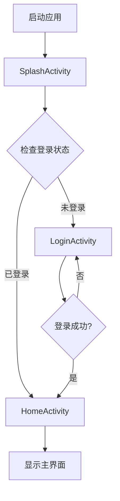
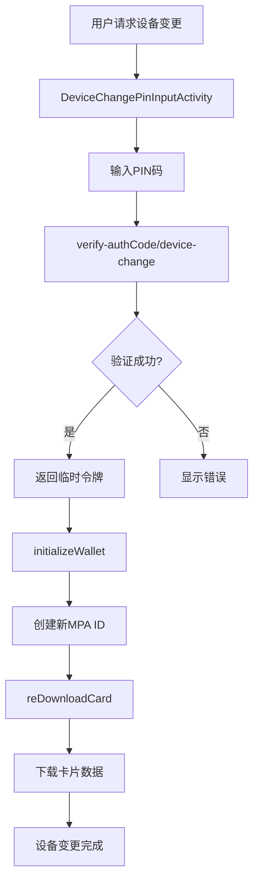
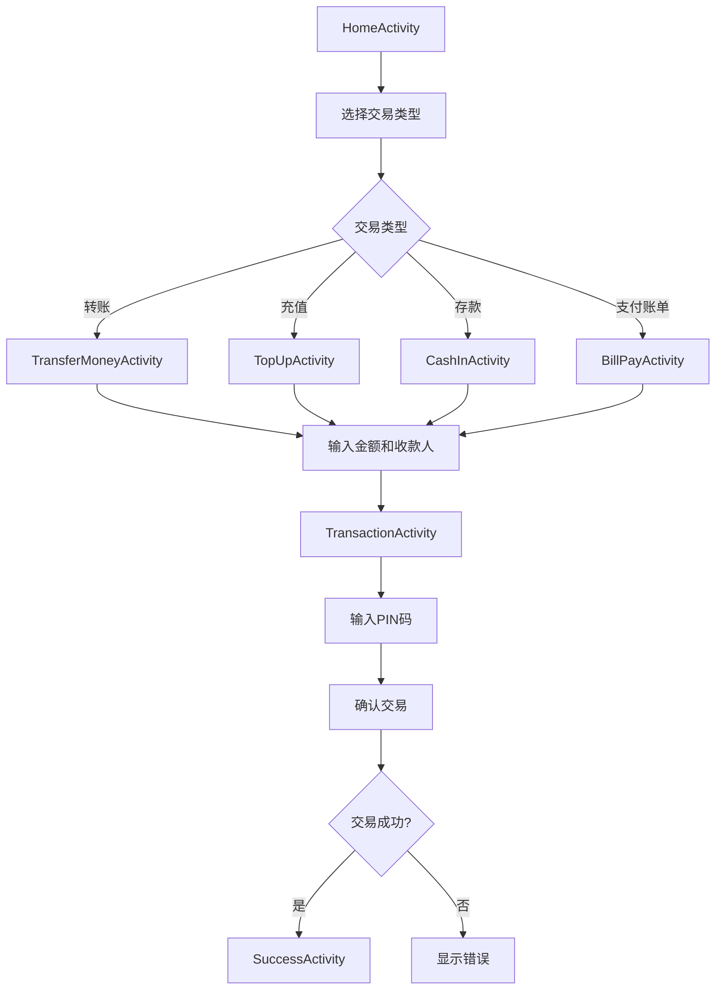
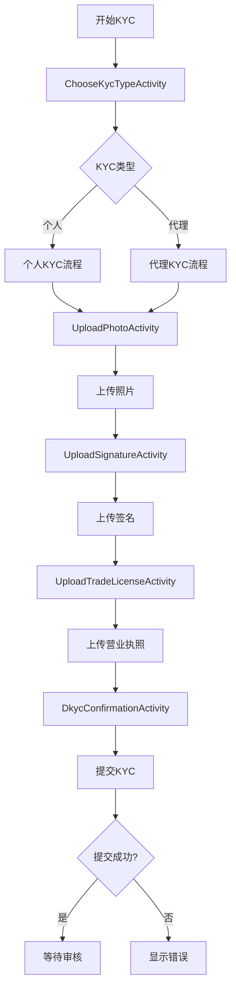
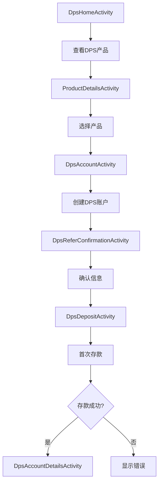

# Nagad Agent App - 分析文档

## 📋 项目概述

**应用名称**: Nagad Agent (Uddokta)  
**包名**: `com.konasl.nagad.agent`  
**版本**: 1.0.104.01 (versionCode: 1104)  
**目标SDK**: Android 35 (Android 14)  
**最低SDK**: Android 21 (Android 5.0)  
**开发公司**: Kona Software Lab Ltd.  

### 🏢 应用背景

Nagad Uddokta 是孟加拉国领先的数字金融服务应用，由 Kona Software Lab Ltd. 开发。该应用主要面向代理商(Uddokta)，提供全面的金融服务解决方案。

**核心功能**:
- 💰 **现金服务** - 从客户钱包中取款/提现(Cash Out)
- 👤 **客户注册** - 新客户开户注册
- 💸 **余额转账** - DSO间余额转账和接收
- 📱 **数字服务** - 账单支付、手机充值等
- 📊 **合规报告** - STR/SAR可疑交易报告提交

**应用特点**:
- ⭐ **评分**: 4.2 (基于28.3万+条评价)
- 🔄 **更新频率**: 持续更新，最新版本发布于2026年2月27日
- 🔒 **数据安全**: 传输中的数据加密，支持数据删除请求
- 🌐 **语言支持**: 孟加拉语(bn)、英语等

**隐私与安全**:
- ✅ 传输数据加密
- ✅ 支持数据删除请求
- ✅ 不共享数据给第三方
- ✅ 收集个人信息、财务信息等5类数据

---

## 📁 项目目录结构

```
uddokta_1104/
├── AndroidManifest.xml          # 应用清单文件
├── assets/                      # 资源文件
│   ├── migrations/              # 数据库迁移文件
│   │   └── 2.sql
│   ├── datafile.txt            # 数据文件
│   ├── labels_mask.txt         # ML模型标签
│   ├── metadata.txt            # 元数据
│   ├── model.tflite            # TensorFlow Lite模型
│   ├── properties.txt          # 配置属性
│   └── wbcconfig.txt           # WBC配置
├── lib/                        # Native库
│   ├── arm64-v8a/              # ARM64架构
│   ├── armeabi-v7a/            # ARM32架构
│   ├── x86/                    # x86架构
│   └── x86_64/                 # x86_64架构
├── res/                        # 资源文件
│   ├── anim/                   # 动画资源
│   ├── animator/               # 属性动画
│   ├── color/                  # 颜色状态列表
│   ├── drawable/               # 图像资源
│   ├── font/                   # 字体文件
│   ├── layout/                 # 布局文件
│   ├── menu/                   # 菜单资源
│   ├── raw/                    # 原始文件
│   ├── values/                 # 值资源
│   ├── values-bn/              # 孟加拉语资源
│   └── xml/                    # XML配置
├── smali/                      # Smali代码(主DEX)
└── smali_classes2/             # Smali代码(次DEX)
```

---

## 🔧 第三方框架和库分析

### 1. 网络请求框架
- **Retrofit2** - REST API客户端
- **OkHttp** - HTTP客户端
- **Gson** - JSON序列化/反序列化

### 2. 依赖注入框架
- **Dagger2** - 依赖注入框架
- **javax.inject** - JSR-330标准注解

### 3. 图片加载框架
- **Glide** - 图片加载和缓存库
- **Coil** - Kotlin协程图片加载库

### 4. 响应式编程
- **RxJava3** - 响应式编程框架
- **RxAndroid** - Android扩展

### 5. UI组件库
- **ButterKnife** - 视图绑定库(已弃用，建议迁移到ViewBinding)
- **AndroidX** - Android扩展库
  - Room Database
  - Media Components

### 6. Firebase服务
- **Firebase Analytics** - 应用分析
- **Firebase Crashlytics** - 崩溃报告
- **Firebase Remote Config** - 远程配置
- **Firebase ML Vision** - 机器学习(人脸检测)
- **Firebase Installations** - 安装管理

### 7. 支付网关
- **SSLCommerz** - 孟加拉国支付网关
  - 生产环境: `https://api-epay.sslcommerz.com/`
  - 沙盒环境: `https://sandbox.sslcommerz.com/`

### 8. 其他服务
- **Facebook SDK** - 社交登录和分析
- **Google Play Services** - Google服务集成
- **Adjust** - 应用跟踪和分析
- **TensorFlow Lite** - 机器学习推理

---

## 🌐 网络请求端点分析

### 主要API端点

#### 1. Nagad核心API
```
基础URL: https://app.mynagad.com:20002/api/
```

**钱包相关接口**:
- `POST /api/wallet/verify-authCode/device-change` - 设备变更验证
- `POST /api/wallet/initializeWallet` - 钱包初始化
- `POST /api/wallet/reDownloadCard` - 重新下载卡片
- `POST /api/wallet/refreshToken` - 刷新令牌

**账单支付接口**:
- `GET /api/billpay/billerList` - 获取账单服务商列表
- `POST /api/billpay/payBill` - 支付账单
- `GET /api/billpay/billDetail` - 获取账单详情

**DPS(存款计划)接口**:
- `POST /api/dps/create` - 创建DPS账户
- `POST /api/dps/deposit` - DPS存款
- `GET /api/dps/details` - DPS详情

**KYC验证接口**:
- `POST /api/kyc/submit` - 提交KYC
- `POST /api/kyc/uploadDocument` - 上传文档

#### 2. SSLCommerz支付网关
```
生产环境: https://api-epay.sslcommerz.com/securepay/api.php/
沙盒环境: https://sandbox.sslcommerz.com/securepay/api.php/
验证API: https://securepay.sslcommerz.com/validator/api/
```

#### 3. Firebase服务
```
Remote Config: https://firebaseremoteconfig.googleapis.com/
Crashlytics: https://update.crashlytics.com/spi/v1/platforms/android/apps
Analytics: https://app-measurement.com/a
ML Vision: https://vision.googleapis.com/
```


---

## 🔐 加密与安全机制分析

### 1. Native安全库

应用使用了多个自定义Native库进行安全防护:

```
libkonaWbc.so        - Kona白盒加密库
libkonacipher.so     - Kona加密算法库
libshield.so         - 应用防护库
libsigner.so         - 签名验证库
libpayment.so        - 支付安全库
libnative-lib.so     - 原生功能库
libtensorflowlite_jni.so - TensorFlow Lite JNI
libgnustl_shared.so  - GNU STL运行时
```

### 2. 加密算法

**对称加密**:
- AES - 数据加密
- 白盒AES - 防止密钥提取

**非对称加密**:
- RSA - 密钥交换和签名

**哈希算法**:
- SHA-256 - 数据完整性
- MD5 - 校验和(不推荐用于安全场景)

### 3. 安全特性

**网络安全配置**:
- 禁用明文流量 (`android:usesCleartextTraffic="false"`)
- 自定义网络安全配置 (`@xml/network_security_config`)
- 证书固定 (Certificate Pinning)

**应用防护**:
- 防调试保护
- 防逆向工程
- 代码混淆
- Native层关键逻辑保护

**数据保护**:
- SharedPreferences加密
- 数据库加密
- 敏感数据内存保护

### 4. JWT令牌安全

**签名算法**: HS512 (HMAC-SHA-512)

**安全特性**:
- 短期令牌(3分钟有效期)
- 令牌刷新机制
- 设备绑定(MPA ID)
- 用户类型验证

---

## 📱 AndroidManifest.xml分析

### 应用配置

```xml
<manifest xmlns:android="http://schemas.android.com/apk/res/android"
    package="com.konasl.nagad.agent"
    android:compileSdkVersion="33"
    android:compileSdkVersionCodename="13">
    
    <application
        android:name="com.konasl.dfs.DfsApplication"
        android:allowBackup="false"
        android:icon="@mipmap/ic_launcher"
        android:label="@string/app_name"
        android:largeHeap="true"
        android:networkSecurityConfig="@xml/network_security_config"
        android:supportsRtl="true"
        android:theme="@style/AppTheme"
        android:usesCleartextTraffic="false">
```

### 权限分析

#### 危险权限
```xml
<uses-permission android:name="android.permission.CAMERA"/>
<uses-permission android:name="android.permission.READ_CONTACTS"/>
<uses-permission android:name="android.permission.POST_NOTIFICATIONS"/>
<uses-permission android:name="android.permission.WRITE_EXTERNAL_STORAGE"
    android:maxSdkVersion="28"/>
```

#### 普通权限
```xml
<uses-permission android:name="android.permission.INTERNET"/>
<uses-permission android:name="android.permission.ACCESS_NETWORK_STATE"/>
<uses-permission android:name="android.permission.ACCESS_WIFI_STATE"/>
<uses-permission android:name="android.permission.NFC"/>
<uses-permission android:name="android.permission.WAKE_LOCK"/>
<uses-permission android:name="android.permission.VIBRATE"/>
```

#### 第三方权限
```xml
<uses-permission android:name="com.google.android.gms.permission.AD_ID"/>
<uses-permission android:name="com.google.android.c2dm.permission.RECEIVE"/>
<uses-permission android:name="com.google.android.finsky.permission.BIND_GET_INSTALL_REFERRER_SERVICE"/>
```

### 硬件特性

```xml
<uses-feature android:name="android.hardware.camera" android:required="false"/>
<uses-feature android:name="android.hardware.camera.autofocus"/>
<uses-feature android:glEsVersion="0x00020000" android:required="true"/>
```

### 主要Activity

#### 启动Activity
```xml
<activity android:name="com.konasl.dfs.ui.splash.SplashActivity"
    android:exported="true"
    android:label="@string/app_name"
    android:theme="@style/AppTheme.NoActionBar">
    <intent-filter>
        <action android:name="android.intent.action.MAIN"/>
        <category android:name="android.intent.category.LAUNCHER"/>
    </intent-filter>
</activity>
```

#### 核心功能Activity
- **SplashActivity** - 启动页
- **LoginActivity** - 登录页
- **HomeActivity** - 主页
- **TransactionActivity** - 交易页
- **TopUpActivity** - 充值页
- **CashInActivity** - 存款页
- **TransferMoneyActivity** - 转账页
- **HistoryActivity** - 历史记录
- **DpsHomeActivity** - DPS主页
- **BillReceiptActivity** - 账单收据

#### KYC验证Activity
- **ChooseKycTypeActivity** - 选择KYC类型
- **ReceiveKycActivity** - 接收KYC
- **AgentPendingKycListActivity** - 待处理KYC列表
- **PendingKycActivity** - 待处理KYC
- **CollectedKycActivity** - 已收集KYC

#### 设备变更Activity
- **DeviceChangePinInputActivity** - 设备变更PIN输入

---

## 🔄 页面跳转流程分析

### 1. 应用启动流程



### 2. 设备变更流程



### 3. 交易流程



### 4. KYC验证流程



### 5. DPS存款计划流程



---

## 🛡️ 安全建议

### 1. 代码安全
- ✅ 使用Native库保护关键逻辑
- ✅ 实施代码混淆
- ✅ 禁用明文流量
- ⚠️ ButterKnife已弃用，建议迁移到ViewBinding
- ⚠️ 部分硬编码URL需要配置化

### 2. 数据安全
- ✅ 使用JWT令牌认证
- ✅ 实施证书固定
- ✅ 加密敏感数据
- ⚠️ 令牌有效期较短，需要优化刷新机制
- ⚠️ 建议增加生物识别认证

### 3. 网络安全
- ✅ 使用HTTPS
- ✅ 实施网络安全配置
- ✅ 证书固定
- ⚠️ 建议增加API请求签名
- ⚠️ 建议增加请求重放保护

### 4. 用户隐私
- ✅ 最小化权限请求
- ✅ 运行时权限请求
- ⚠️ 建议增加隐私政策说明
- ⚠️ 建议增加数据导出功能

---

## 📊 技术栈总结

### 开发语言
- **Java** - 主要开发语言
- **Kotlin** - 部分模块(从Coil库推断)

### 架构模式
- **MVVM** - Model-View-ViewModel架构
- **Repository Pattern** - 数据仓库模式
- **Dependency Injection** - 依赖注入

### 数据存储
- **Room Database** - 本地数据库
- **SharedPreferences** - 轻量数据存储
- **SQLite** - 关系型数据库


---

## 📝 免责声明

本文档仅用于技术研究和学习目的。请遵守以下原则:

1. **合法使用** - 仅在授权范围内进行分析
2. **尊重知识产权** - 不得用于商业用途
3. **安全研究** - 用于安全研究和漏洞修复
4. **遵守法律** - 遵守当地法律法规

---

## 🤝 贡献指南

如果您发现任何错误或有改进建议，欢迎:
- 提交Issue
- 发起Pull Request
- 分享您的发现

---

## 📄 许可证

本文档采用 [CC BY-NC-SA 4.0](https://creativecommons.org/licenses/by-nc-sa/4.0/) 许可协议。

---

---

## 🔗 相关链接

### 官方资源
- **Google Play**: [Nagad Uddokta on Google Play](https://play.google.com/store/apps/details?id=com.konasl.nagad.agent)
- **隐私政策**: [Privacy Policy](https://nagad.com.bd/privacy-policy/)
- **开发者**: [Kona Software Lab Ltd.](https://konasl.com)

### 应用信息
- **应用ID**: `com.konasl.nagad.agent`
- **应用类别**: 金融/商务
- **内容分级**: 适合所有人
- **安装量**: 100万+
- **应用大小**: 约 50MB

### 支持语言
- 🇧🇩 **孟加拉语** (বাংলা)
- 🇬🇧 **英语** (English)

---

**最后更新**: 2025-012-13  
**文档版本**: 1.1  
**数据来源**: Google Play Store
